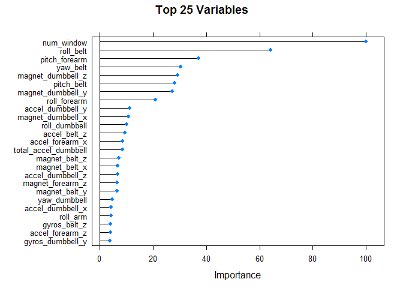
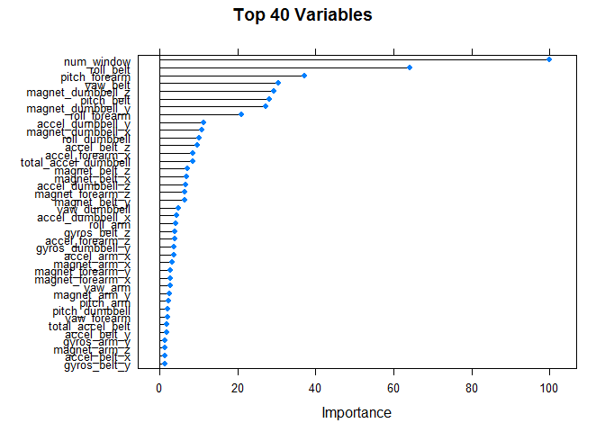

# PML
Demyd Dzyuban  

#Project task
The goal of your project is to predict the manner in which they did the exercise. This is the "classe" variable in the training set. You may use any of the other variables to predict with. 

#Loading necessary libraries


```r
library(ggplot2)
library(caret)
library(randomForest)
library(e1071)
library(gbm)
library(doParallel)
library(survival)
library(splines)
library(plyr)
```

#Raw data reading and preprocessing

```r
wrkdir <- "D:/Dimon/Coursera/Machine_learning/project"
setwd(wrkdir)

# load data
training <- read.csv("pml-training.csv", na.strings=c("#DIV/0!"), row.names = 1)
testing <- read.csv("pml-testing.csv", na.strings=c("#DIV/0!"), row.names = 1)
training <- training[, 6:dim(training)[2]]

treshold <- dim(training)[1] * 0.95
#clear data of columns with more than 95% of NA or "" values
goodColumns <- !apply(training, 2, function(x) sum(is.na(x)) > treshold  || sum(x=="") > treshold)

training <- training[, goodColumns]

badColumns <- nearZeroVar(training, saveMetrics = TRUE)

training <- training[, badColumns$nzv==FALSE]

training$classe = factor(training$classe)

#split raw data into training and crossvalidation
inTrain <- createDataPartition(training$classe, p = 0.6)[[1]]
crossv <- training[-inTrain,]
training <- training[ inTrain,]
inTrain <- createDataPartition(crossv$classe, p = 0.75)[[1]]
crossv_test <- crossv[ -inTrain,]
crossv <- crossv[inTrain,]


testing <- testing[, 6:dim(testing)[2]]
testing <- testing[, goodColumns]
testing$classe <- NA
testing <- testing[, badColumns$nzv==FALSE]
```

#Calculate models

```r
mod1 <- train(classe ~ ., data=training, method="rf")
#mod2 <- train(classe ~ ., data=training, method="gbm")
#mod3 <- train(classe ~ ., data=training, method="lda")

pred1 <- predict(mod1, crossv)
#pred2 <- predict(mod2, crossv)
#pred3 <- predict(mod3, crossv)
```


```r
#check confusion matrix
confusionMatrix(pred1, crossv$classe)
```

```
## Confusion Matrix and Statistics
## 
##           Reference
## Prediction    A    B    C    D    E
##          A 1674    5    0    0    0
##          B    0 1133    3    0    2
##          C    0    1 1023    3    0
##          D    0    0    0  962    2
##          E    0    0    0    0 1078
## 
## Overall Statistics
##                                           
##                Accuracy : 0.9973          
##                  95% CI : (0.9956, 0.9984)
##     No Information Rate : 0.2844          
##     P-Value [Acc > NIR] : < 2.2e-16       
##                                           
##                   Kappa : 0.9966          
##  Mcnemar's Test P-Value : NA              
## 
## Statistics by Class:
## 
##                      Class: A Class: B Class: C Class: D Class: E
## Sensitivity            1.0000   0.9947   0.9971   0.9969   0.9963
## Specificity            0.9988   0.9989   0.9992   0.9996   1.0000
## Pos Pred Value         0.9970   0.9956   0.9961   0.9979   1.0000
## Neg Pred Value         1.0000   0.9987   0.9994   0.9994   0.9992
## Prevalence             0.2844   0.1935   0.1743   0.1639   0.1838
## Detection Rate         0.2844   0.1925   0.1738   0.1634   0.1831
## Detection Prevalence   0.2853   0.1933   0.1745   0.1638   0.1831
## Balanced Accuracy      0.9994   0.9968   0.9981   0.9982   0.9982
```

```r
#confusionMatrix(pred2, crossv$classe)
#confusionMatrix(pred3, crossv$classe)
```


```r
#out-of-sample error
pred1 <- predict(mod1, crossv_test)
#pred3 <- predict(mod3, crossv_test)
accuracy <- sum(pred1 == crossv_test$classe) / length(pred1)
```


Running scripts shows that Random Forest prediction isbetter than either the GBM or lsa models. -> The confusion matrix has the accuracy of 99.6%. Such a result could be treated as "acceptable".
 
As a double check the out of sample error was calculated. This model achieved 99.7449 % accuracy on the validation set.


#Model tuning
To define the optimal number of variables (25 and 40):

```r
#top 25 variables
varImpRF <- train(classe ~ ., data = training, method = "rf")
varImpObj <- varImp(varImpRF)
# Top 25 plot
plot(varImpObj, main = "Top 25 Variables", top = 25)
```



```r
# Top 40 plot
plot(varImpObj, main = "Top 40 Variables", top = 40)
```



#Summary:

The Random Forest method worked very well.

The Confusion Matrix has 99.6% of accuracy. 
The Out of Sample Error achieved 99.7449 %.

I conclude that this model could be used for the next calclations.

Approach to solving of this problem:

1. Random forest is good to handle a large number of inputs.
2. Internal cross valiidation gives an unbiased estimate of the forest’s out-of-sample error rate.
3. Random forest can handle unscaled variables and categorical variables. 


